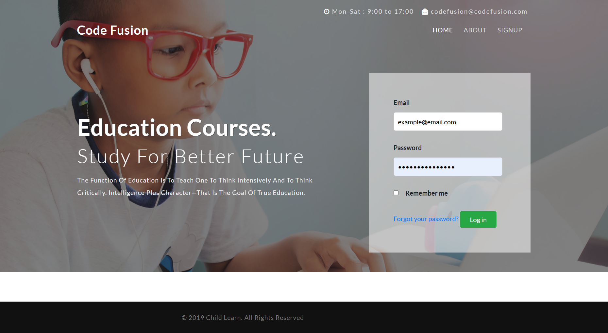
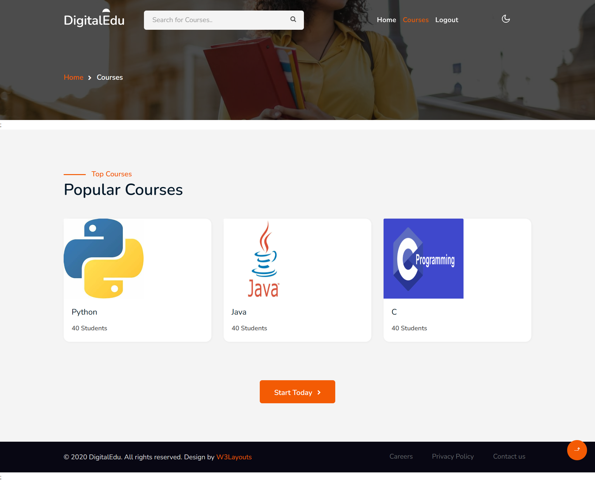
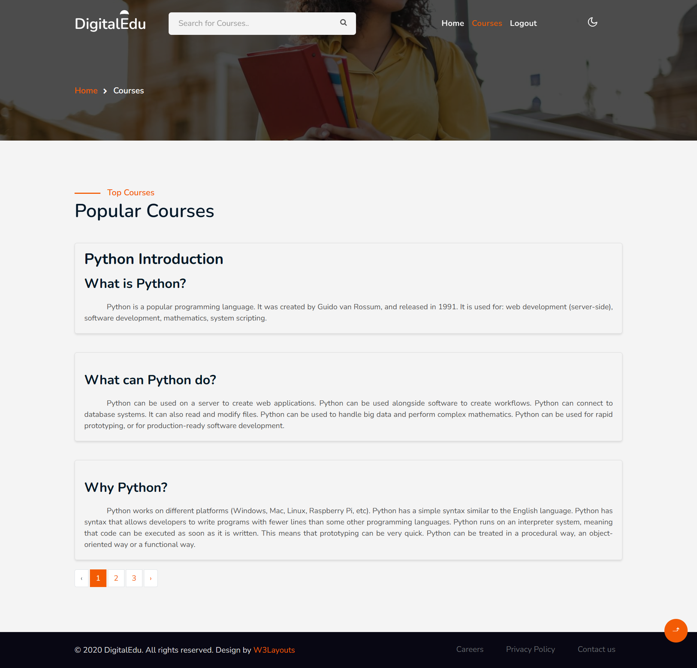
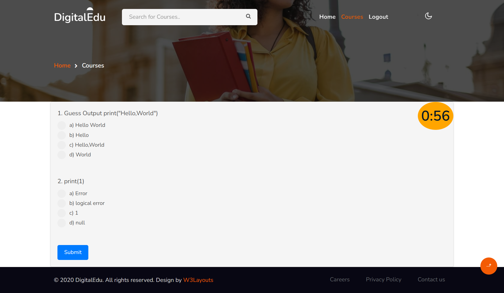

<h1>Code Fusion - Online Code Teaching Platform</h1>

    Code Fusion is an online code teaching platform built using Laravel. It includes modules for both administrators and users,
    providing features such as code compilation and running.

<h2>Features</h2>
<ul>
    <li>Admin and User Modules</li>
    <li>Code Compiler and Runner</li>
  
</ul>

<h2>Getting Started</h2>

<h3>Prerequisites</h3>

    Before you begin, ensure you have the following installed:
    <ul>
        <li>PHP</li>
        <li>Composer</li>
        <li>Node.js</li>
        <li>MySQL</li>
    </ul>

<h3>Installation</h3>

    1. Clone the repository:
    <pre><code>git clone https://github.com/Jyothish9988/Code-Fusion.git</code></pre>

    2. Install dependencies:
    <pre><code>composer install</code></pre>
    <pre><code>npm install</code></pre>

    3. Configure the environment:
    <pre><code>cp .env.example .env</code></pre>
    Update the database and other configuration settings in the .env file.

    4. Run migrations and seed the database:
    <pre><code>php artisan migrate --seed</code></pre>

    5. Start the development server:
    <pre><code>php artisan serve</code></pre>

<h2>Usage</h2>

    Visit the application in your browser and start exploring the features.

<h2>Contributing</h2>

    Contributions are welcome! Please fork the repository and submit a pull request.

# Module

1.Admin

2.User

 # Images
 <h3>Main</h3> 
 
 <h3>Course Page</h3> 
 
 <h3>Course Outline</h3> 
 
 <h3>Course Intro</h3> 
 
 <h3>Quiz</h3> 
 
<h2>License</h2>

    This project is licensed under the MIT License - see the <a href="LICENSE">LICENSE</a> file for details.

